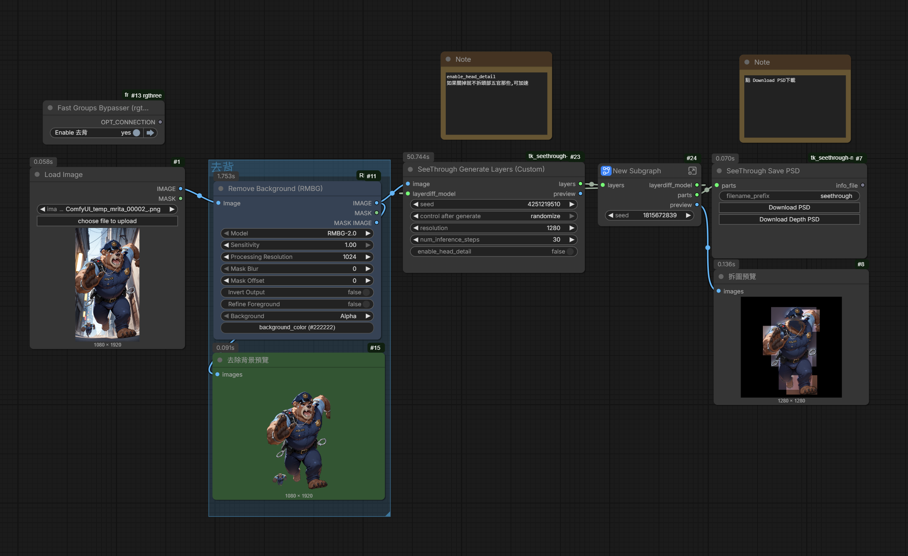

# ComfyUI-See-through (Custom Fork)



A fork of [ComfyUI-See-through](https://github.com/jtydhr88/ComfyUI-See-through) by [@jtydhr88](https://github.com/jtydhr88), adding a custom node with the option to skip the head detail inference stage for faster processing.

[中文說明](README_ZH.md)

## What's New in This Fork

### SeeThrough Generate Layers (Custom)

A new node `SeeThrough_GenerateLayers_Custom` that adds one parameter compared to the original `SeeThrough Generate Layers`:

| Parameter | Default | Description |
|-----------|---------|-------------|
| `enable_head_detail` | true | v3 models only: toggle the head detail inference stage on/off |

#### How It Works

The v3 See-through model runs in **two inference stages**:

1. **Body stage** — Generates 13 body-level layers (front hair, back hair, head, neck, neckwear, topwear, handwear, bottomwear, legwear, footwear, tail, wings, objects)
2. **Head stage** — Crops the head region from stage 1, upscales it, and runs a second inference pass to generate 11 fine-grained head layers (headwear, face, irides, eyebrow, eyewhite, eyelash, eyewear, ears, earwear, nose, mouth)

Each stage is a full diffusion pipeline call. By setting `enable_head_detail = false`, the entire head stage is **skipped** (no GPU computation), saving approximately **50% of the total inference time**.

This is useful when you only need body-level decomposition and don't require fine-grained facial features.

> **Note:** For v2 models, this toggle has no effect since v2 uses a single-stage inference.

### v0.2.2 — Synced with Upstream

This fork has been synced with [upstream v0.2.2](https://github.com/jtydhr88/ComfyUI-See-through), incorporating the following improvements:

- **VRAM Offloading** — Models now stay on CPU and are moved to GPU only during inference, then offloaded back. This significantly reduces VRAM usage, making it possible to run on GPUs with 8GB or less.
- **Text Encoder Offloading** — Text encoders are loaded to GPU for prompt encoding, then offloaded before loading UNet+VAE, so they never compete for VRAM at the same time.
- **Marigold Compatibility Fix** — Fixed `resize` call for torchvision >= 0.23 which introduced stricter `InterpolationMode` checks.
- **Web Fixes** — Subpath deployment support; ag-psd bundle 404 fix on case-sensitive filesystems.
- **Custom Node Optimization** — When `enable_head_detail = false`, head text encoding is also skipped (not just diffusion), further reducing GPU memory usage.

## All Nodes

| Node | Description |
|------|-------------|
| **SeeThrough Load LayerDiff Model** | Load the LayerDiff SDXL pipeline |
| **SeeThrough Load Depth Model** | Load the Marigold depth estimation pipeline |
| **SeeThrough Generate Layers** | Original layer generation (all stages, all layers) |
| **SeeThrough Generate Layers (Custom)** | Layer generation with `enable_head_detail` toggle |
| **SeeThrough Generate Depth** | Depth map estimation per layer |
| **SeeThrough Post Process** | Left/right splitting, hair clustering, color restoration |
| **SeeThrough Save PSD** | Export layers as PNGs + metadata; download PSD via browser |
| **SeeThrough Layer Rename** | Rename layer tags to Spine-friendly names (customizable) |
| **SeeThrough Layer Filter** | Include/exclude specific layers before export |
| **SeeThrough Export Spine** | Export layers as a Spine 2D skeleton project (JSON + images) |

### Spine Export Workflow

For [Spine](http://esotericsoftware.com/) animation preparation, connect:

```
PostProcess → Layer Rename (optional) → Layer Filter (optional) → Export Spine
```

- **Layer Rename** maps internal tags (e.g. `hairf`, `eyel`) to Spine-friendly names (e.g. `front-hair`, `eye-left`). Built-in defaults cover all tags; override with a JSON object in `custom_mapping_json`.
- **Layer Filter** removes unwanted layers using include or exclude mode. All available tags are pre-filled by default — delete the ones you don't need. Enter one tag per line.
- **Export Spine** outputs a folder with a configurable output path (defaults to ComfyUI output directory):
  - `{prefix}.json` — Spine skeleton file (open directly in Spine editor)
  - `images/` — cropped PNG files for each layer

Coordinates are automatically converted from image space (Y-down) to Spine space (Y-up, origin at bottom-center). Draw order follows depth ordering from PostProcess.

<details>
<summary>Available layer tags (after LayerRename, 38 tags)</summary>

| Category | Tags |
|----------|------|
| Hair | `front-hair`, `back-hair` |
| Head | `head`, `headwear` |
| Face | `face`, `nose`, `mouth` |
| Eyes | `eye-left`, `eye-right`, `eyewear` |
| Eye detail | `irides`, `irides-left`, `irides-right`, `eyebrow`, `eyebrow-left`, `eyebrow-right`, `eye-white`, `eye-white-left`, `eye-white-right`, `eyelash`, `eyelash-left`, `eyelash-right` |
| Ears | `ears`, `ear-left`, `ear-right`, `earwear` |
| Body | `neck`, `neckwear`, `topwear`, `bottomwear` |
| Limbs | `handwear`, `handwear-left`, `handwear-right`, `legwear`, `footwear` |
| Other | `tail`, `wings`, `objects` |

If not using LayerRename, use original tags: `hairf`, `hairb`, `eyel`, `eyer`, `handwearl`, `handwearr`, `earl`, `earr`, etc.

</details>

## Installation

Clone this repository into your ComfyUI `custom_nodes` directory:

```bash
cd ComfyUI/custom_nodes
git clone https://github.com/tackcrypto1031/tk_seethrough.git
```

Install dependencies:

```bash
cd tk_seethrough
pip install -r requirements.txt
```

Restart ComfyUI. The nodes will appear under the `SeeThrough` category.

### Models

Models are downloaded automatically from HuggingFace on first use:

| Model | HuggingFace Repo | Purpose |
|-------|-------------------|---------|
| LayerDiff 3D | `layerdifforg/seethroughv0.0.2_layerdiff3d` | SDXL-based transparent layer generation |
| Marigold Depth | `24yearsold/seethroughv0.0.1_marigold` | Fine-tuned monocular depth for anime |

You can also download models manually and place them in `ComfyUI/models/SeeThrough/`.

## Usage

1. Add **SeeThrough Load LayerDiff Model** and **SeeThrough Load Depth Model**
2. Add **SeeThrough Generate Layers (Custom)** — connect both models and a **Load Image** node
3. Uncheck `enable_head_detail` if you want faster processing without head detail layers
4. Connect to **SeeThrough Generate Depth** → **SeeThrough Post Process** → **SeeThrough Save PSD**
5. Run the workflow and click **Download PSD** to export

**For Spine export:** Replace step 4's **Save PSD** with **Layer Rename** → **Layer Filter** → **Export Spine**. Open the output JSON in Spine editor.

## Acknowledgements

This project is a fork of [ComfyUI-See-through](https://github.com/jtydhr88/ComfyUI-See-through) by [@jtydhr88](https://github.com/jtydhr88). Huge thanks for creating the original ComfyUI integration.

The underlying research is [See-through](https://github.com/shitagaki-lab/see-through) by [shitagaki-lab](https://github.com/shitagaki-lab).
Paper: [arxiv:2602.03749](https://arxiv.org/abs/2602.03749) (Conditionally accepted to ACM SIGGRAPH 2026)

PSD generation uses [ag-psd](https://github.com/nicasiomg/ag-psd) in the browser.

## License

MIT
